# Deployment of Expense web application using Kubernetes + Docker
This will create docker image and deploy pods using that image

1. namespace
```
kubectl create ns expense-app
kubectl get ns
```

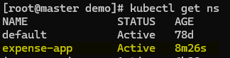

2. pv
```
kubectl apply -f pv.yaml
kubectl get pv
```
3. pvc
```
kubectl apply -f pvc.yaml
kubectl get pvc -n expense-app
```

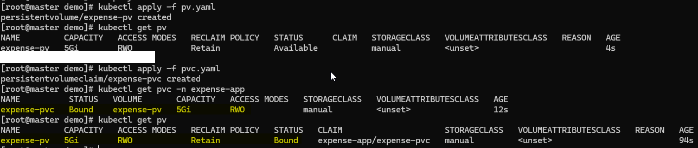

4. configMap
```
kubectl apply -f configFile.yaml
kubectl get cm -n expense-app
```

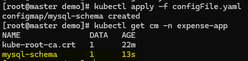

5. secrets
```
kubectl apply -f secretFile.yaml
kubectl get secrets -n expense-app
```

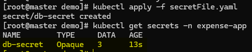

6. database
```
kubectl apply -f db.yaml
kubectl get all -l app=db -n expense-app
```

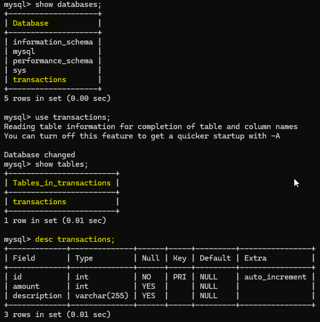

7. backend image
```
nerdctl build -t backend:01 -f backendImage/Dockerfile .
nerdctl tag backend:01 localhost:5000/backend:01
nerdctl push localhost:5000/backend:01
```

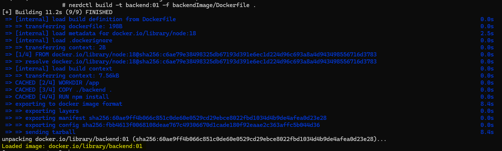
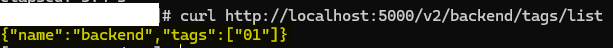

8. backend deployment
```
kubectl apply -f backend.yaml
kubectl get all -l app=backend -n expense-app
```

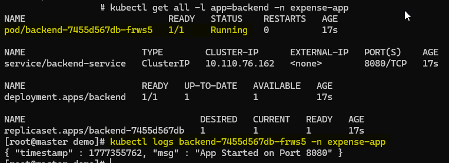
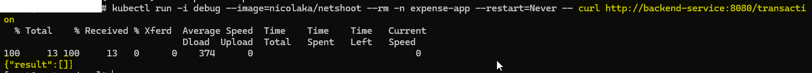

9. frontend image
```
nerdctl build -t frontend:01 -f frontendImage/Dockerfile .
nerdctl tag frontend:01 localhost:5000/frontend:01
nerdctl push localhost:5000/frontend:01
```

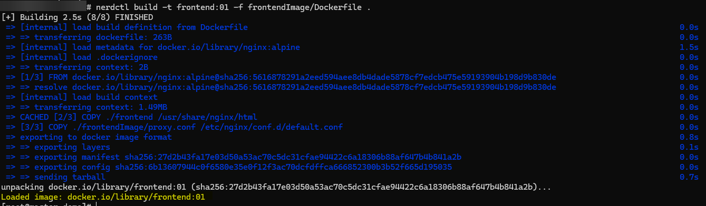
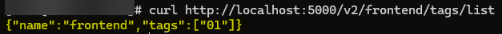

10. frontend deployment
```
kubectl apply -f frontend.yaml
kubectl get all -l app=frontend -n expense-app
```

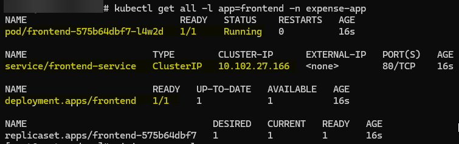

11. ingress-nginx
```
kubectl apply -f https://raw.githubusercontent.com/kubernetes/ingress-nginx/main/deploy/static/provider/baremetal/deploy.yaml

```
kubectl apply -f ingress.yaml
```
Browser     (curl http://expense-app.local:31362)
   ↓
expense-app.local
   ↓
Ingress Controller
   ├── /      → frontend
   └── /api   → backend
```

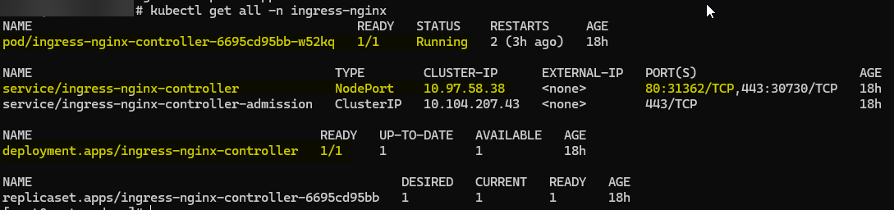
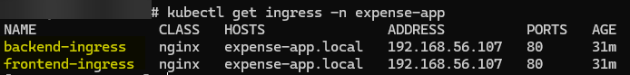

- Browser View

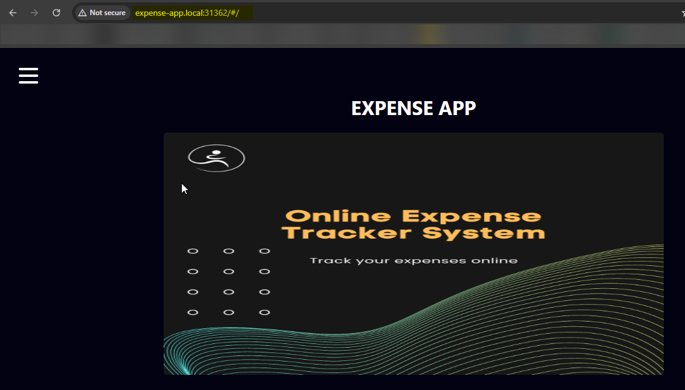
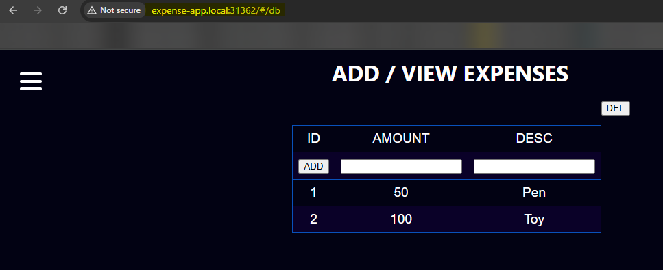
